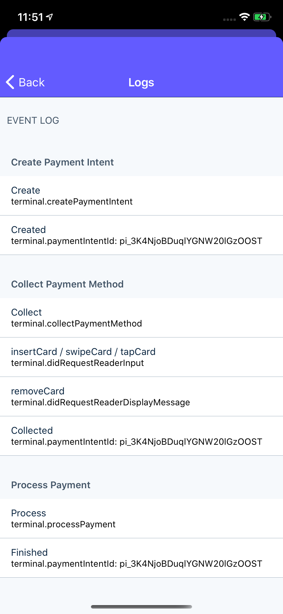

# Example applications

## Try Stripe Terminal by using the example applications and simulated reader.

> For a more immersive guide, check out the [sample integration](https://stripe.com/docs/terminal/integration-builder).

A Stripe Terminal integration starts with your point of sale application running at a physical location. Your point of sale application communicates with a reader through the Terminal SDK to collect in-person payments from your customers. Your backend works with your point of sale application to authenticate the Terminal SDK and finalize payments.

Before starting your own integration, we recommend setting up one of the Terminal example applications. This will give you a better feel for how the components of a Terminal integration fit together and show you the interactions between the SDK, the reader, your point of sale application, and your backend code.

## 1. Deploy the example backend

To get started with the example applications, set up the Sinatra-based [example backend](https://github.com/stripe/example-terminal-backend) by following the instructions in the [README](https://github.com/stripe/example-terminal-backend). You can either run the backend locally or deploy it to Heroku with a free account. The example backend works with the example application to authenticate the Terminal SDK and finalize payments.

## 2. Run example application

Build and run one of the example applications:

## React Native

- Clone the example from [GitHub](https://github.com/stripe/stripe-terminal-react-native):

```
git clone https://github.com/stripe/stripe-terminal-react-native.git
```

- Install the dependencies
  - `yarn bootstrap`
- Set your api key in your environment
  - `cp sample/.env.example sample/.env`
  - edit `.env`
- Start the backend
  - `yarn example start:server`
- Start the example
  - Terminal 1: `yarn example start`
  - Terminal 2: depending on what platform you want to build for run either
    - `yarn example ios`
    - or
    - `yarn example android`

## 3. Connect to a simulated reader

After you have the example running, select `Simulated` to connect to a [simulated reader](https://stripe.com/docs/terminal/references/testing#simulated-reader).

> To run the example app using the iOS Simulator, enable a simulated location. Select Simulate Location from the Xcode Debug menu. For more information on how Stripe Terminal uses the device location, see [Configure your iOS app](./set-up-your-sdk.md#configure-your-app).

The simulated reader handles events just like a physical reader, so you can continue to collecting your first payment.

The simulated reader functionality is built into the SDK, so you can use it to develop and test your own point of sale application without connecting to a physical device.

## 4. Collect your first payment

Collect your first payment using the example application and a simulated reader. Each of the examples features an event log for you to reference as you integrate Terminal in your own application. As you collect your first payment, you’ll see the following sequence:

- **Create payment:** The example application collects a payment method using the SDK.
- **Collect payment method:** The simulated reader receives a card.
- **Process and capture:** The example application and backend finalize the payment.


